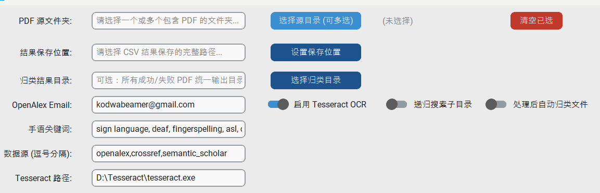

# PDF Metadata Extractor for Sign Language Literature

一个基于Python的GUI工具，用于批量处理PDF学术文献，自动提取元数据，并过滤出手语相关的研究文献。支持从多个开源学术数据库获取元数据，包括期卷数信息。

[](https://www.python.org/downloads/)
[](https://opensource.org/licenses/MIT)
[](https://github.com/TomSchimansky/CustomTkinter)

## ✨ 主要特性

- **📁 批量PDF处理**：支持选择多个文件夹，递归搜索PDF文件
- **🔍 智能DOI提取**：从PDF文本层自动提取DOI，支持OCR备用方案
- **🌐 多数据源支持**：从多个学术数据库获取元数据
  - **OpenAlex** - 全面的学术元数据
  - **Crossref** - 权威的DOI注册数据
  - **Semantic Scholar** - 学术图谱增强数据
- **🎯 手语文献过滤**：基于关键词自动过滤手语相关文献
- **📊 期卷数提取**：自动提取期刊的卷号、期号信息
- **🔤 OCR支持**：集成Tesseract OCR，处理扫描版PDF
- **📂 智能文件分类**：自动将成功/失败的PDF分类到不同文件夹
- **📈 进度跟踪**：实时显示处理进度和状态
- **💾 结果导出**：导出为CSV格式，支持中文字符
- **📝 任务日志**：自动生成处理日志，便于追踪

## 📸 界面预览



*注：实际界面可能略有不同*

## 🛠️ 安装要求

### 系统要求
- **操作系统**: Windows 10/11, macOS, Linux (已测试)
- **Python版本**: 3.8 或更高版本
- **内存**: 推荐 4GB+
- **磁盘空间**: 100MB 可用空间

### 安装步骤

1. **克隆仓库**
   ```bash
   git clone https://github.com/yourusername/pdf-metadata-extractor.git
   cd pdf-metadata-extractor
   ```

2. **创建虚拟环境 (推荐)**
   ```bash
   python -m venv venv
   # Windows
   venv\Scripts\activate
   # Linux/macOS
   source venv/bin/activate
   ```

3. **安装Python依赖**
   ```bash
   pip install -r requirements.txt
   ```

4. **安装Tesseract OCR (可选，但推荐)**
   - **Windows**: 从 [UB-Mannheim Tesseract](https://github.com/UB-Mannheim/tesseract/wiki) 下载安装
   - **Ubuntu/Debian**: `sudo apt install tesseract-ocr`
   - **macOS**: `brew install tesseract`
   
   安装后，在工具中设置Tesseract路径（默认：`D:\Tesseract\tesseract.exe`）

## 🚀 快速开始

1. **启动应用程序**
   ```bash
   python batch.py
   ```

2. **选择PDF文件夹**
   - 点击"选择源目录 (可多选)"按钮
   - 选择一个或多个包含PDF的文件夹
   - 支持递归搜索子目录（启用开关）

3. **配置输出路径**
   - 点击"设置保存位置"按钮
   - 选择CSV结果文件的保存位置

4. **调整设置**
   - **OpenAlex Email**: 用于API标识（可选）
   - **手语关键词**: 自定义过滤关键词
   - **数据源**: 逗号分隔的数据源列表（默认：`openalex,crossref,semantic_scholar`）
   - **OCR设置**: 启用/禁用OCR，设置Tesseract路径

5. **开始处理**
   - 点击"开始执行任务"按钮
   - 查看实时日志和进度条
   - 随时点击"停止"按钮中断处理

## ⚙️ 配置说明

### 数据源配置
支持以下数据源（按优先级顺序）：
```bash
openalex,crossref,semantic_scholar  # 默认顺序
```

- **openalex**: 全面的元数据，包括概念标签
- **crossref**: 权威的DOI数据，期卷数信息准确
- **semantic_scholar**: 学术图谱数据，补充信息

### 关键词配置
默认关键词用于过滤手语相关文献：
```
sign language, deaf, fingerspelling, asl, csl, gloss recognition
```

可以自定义关键词，用逗号分隔：
```
手语, 聋人, 手势识别, 手语翻译
```

### OCR设置
- **启用Tesseract OCR**: 当PDF文本层不足时自动使用OCR
- **Tesseract路径**: 指向tesseract.exe的完整路径
- **OCR文本阈值**: 少于100字符时触发OCR

## 📊 输出格式

结果保存为CSV文件，包含以下列：

| 列名 | 说明 | 示例 |
|------|------|------|
| **文件名** | PDF文件名 | `paper123.pdf` |
| **DOI** | 数字对象标识符 | `10.1007/s12345-023-45678-9` |
| **文献名称** | 文章标题 | `A Novel Approach to Sign Language Recognition` |
| **作者名称** | APA格式作者列表 | `Smith, J., & Johnson, A.` |
| **语种** | 文章语言 | `英文` / `中文` |
| **出版年份** | 出版年份 | `2023` |
| **发表期刊名称** | 期刊/会议名称 | `Journal of Deaf Studies` |
| **期卷数** | 格式化期卷数 | `12(3)` |
| **卷** | 卷号 | `12` |
| **期** | 期号 | `3` |
| **数据来源** | 元数据来源 | `openalex` |
| **状态** | 处理状态 | `成功` / `失败` |
| **来源文件夹** | 原始文件夹 | `papers_2023` |
| **error** | 错误信息（如果失败） | `无 DOI` |

## 🗂️ 文件分类

启用"处理后自动归类文件"后，工具会自动将PDF分类：

```
归类结果目录/
├── 完成/          # 成功处理的PDF
│   └── paper1.pdf
└── 失败/          # 处理失败的PDF
    └── paper2.pdf
```

## 🔧 高级功能

### 续传处理
如果结果文件已存在，工具会：
- 读取已有的处理结果
- 跳过已处理的文件
- 只处理新增的PDF文件

### 并发处理
- 支持多线程API请求
- 可配置最大工作线程数（默认：3）
- 定期保存结果，防止数据丢失

### 任务日志
每次运行生成日志文件 `{结果文件名}_task_log.txt`：
```
[2024-03-15 14:30] 已完成：
  处理目录：/path/to/papers
  总文件：50，成功：42，失败：8
  结果文件：Result_Metadata.csv
------------------------------
```

## 🤝 贡献指南

欢迎贡献！请按以下步骤：

1. Fork 本仓库
2. 创建功能分支 (`git checkout -b feature/amazing-feature`)
3. 提交更改 (`git commit -m 'Add some amazing feature'`)
4. 推送到分支 (`git push origin feature/amazing-feature`)
5. 开启 Pull Request

### 开发环境设置
```bash
# 安装开发依赖
pip install pytest black mypy

# 运行测试
pytest tests/

# 代码格式化
black batch.py

# 类型检查
mypy batch.py
```

## 📝 许可证

本项目采用 MIT 许可证 - 查看 [LICENSE](LICENSE) 文件了解详情。

## 🙏 致谢

- **OpenAlex** - 免费的学术元数据API
- **Crossref** - 权威的DOI注册机构
- **Semantic Scholar** - 学术图谱API
- **PyMuPDF** - 高效的PDF处理库
- **CustomTkinter** - 现代化的Python GUI框架

## 📞 支持与反馈

- **问题报告**: [GitHub Issues](https://github.com/yourusername/pdf-metadata-extractor/issues)
- **功能请求**: 通过Issue提交
- **使用问题**: 查看常见问题或创建Issue

---

**注意**: 本项目仅供学术研究使用。请遵守各API服务的使用条款，合理控制请求频率。